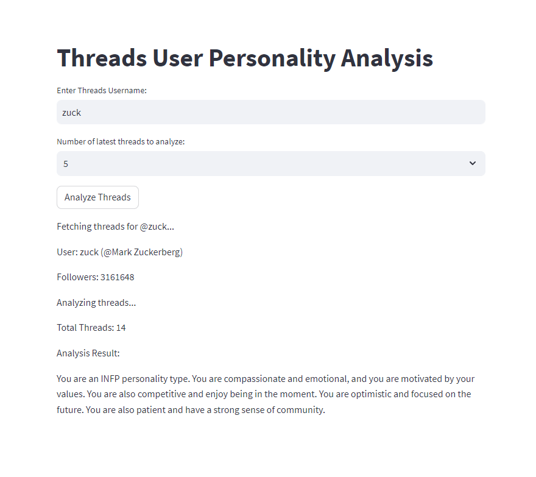

# Threads User Personality Analysis App



## Overview

This is a simple Streamlit web application that allows users to enter a Threads username, fetch the user's information, and perform analysis on the user's threads. The app provides insights into the user's threads content, and displays the results of the personality analysis.

## Requirements

- Python 3.6 or later
- Streamlit
- threads-net

## Setup Instructions

1. Clone this repository to your local machine using the following command:
```
git clone https://github.com/ruitang2create/threads_personality_analysis.git
```
2. Navigate to the project directory:
```
cd threads_personality_analysis
```
3. (Optional) Create and activate a virtual environment (recommended) to isolate project dependencies:
- On Windows:
  ```
  python -m venv venv
  venv\Scripts\activate
  ```
- On macOS/Linux:
  ```
  python3 -m venv venv
  source venv/bin/activate
  ```

4. Install the required dependencies:
```
pip install -r requirements.txt
```

## How to Run

1. After completing the setup instructions, run the Streamlit app using the following command:
```
streamlit run app.py
```

2. The app will start, and you will see a local URL (usually `http://localhost:8501/`) in the terminal.

3. Open your web browser and visit the provided URL to access the app.

## Example Usage

1. Enter a Threads username in the input field.
2. Click the "Test Personality" button to fetch the user's threads and perform the personality analysis.
3. It will also show the results of the personality analysis, which can be customized based on your implementation in `utils/analysis.py`.

## Additional Notes

- You can customize the threads analysis logic in `utils/analysis.py` to perform different types of analysis on the user's threads.
- Make sure to respect Threads's terms of service and API usage policies when using this application.


```python
PYTHONPATH=. python -m streamlit run app.py
```